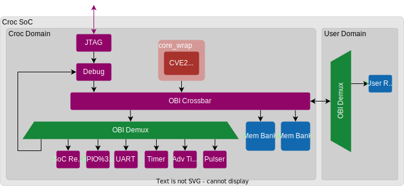
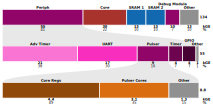

# CROC with Pulser and Advanced Timer

This repository was forked from the [ETHZ CROC](https://github.com/pulp-platform/croc) project.
It was developed as part of the VLSI II course at ETH Zurich.

These CROC modifications were developed in collaboration with **Ivan Herger** (GitHub: [ivherger](https://github.com/ivherger)).

## Overview

The new design added two peripherals to the original CROC design:

1. [**Pulser**](https://github.com/pulp-platform/pulser) – A configurable pulse generator. This peripheral was self-developed and open-sourced to the pulp platform by me.
2. [**APB Advanced Timer**](https://github.com/nicoca20/apb_adv_timer) – An extended timer with advanced control capabilities.

## Documentation

For general information about CROC, its setup, and original documentation, see the [ETHZ_README.md](ETHZ_README.md) file in this repository.

## Block Diagram

The block diagram below illustrates the integration of the Pulser and Advanced Timer modules into the CROC design.

## Memory Map

The address map of the CROC is:

| Start Address   | End  Address    | Description                   |
|-----------------|-----------------|-------------------------------|
| `32'h0000_0000` | `32'h0004_0000` | Debug module                  |
| `32'h0300_0000` | `32'h0300_1000` | SoC control                   |
| `32'h0300_2000` | `32'h0300_3000` | UART peripheral               |
| `32'h0300_5000` | `32'h0300_6000` | GPIO peripheral               |
| `32'h0300_A000` | `32'h0300_B000` | Timer peripheral              |
| `32'h0300_C000` | `32'h0300_D000` | Pulser peripheral             |
| `32'h0300_E000` | `32'h0300_F000` | Adv Timer peripheral          |
| `32'h1000_0000` | `+SRAM_SIZE`    | Memory banks (SRAM)           |
| `32'h2000_0000` | `32'h5000_0000` | User Domain                   |
| `32'h2000_0000` | `32'h2000_1000` | USER ROM                      |

## Area Distribution

The figure below shows the area distribution of the modified design, including the Pulser and Advanced Timer modules in kilo Gate Equivalents (kGE).

  
*Figure: Synthesis results showing the relative area contribution of each module.*

## License

Unless specified otherwise in the respective file headers, all code checked into this repository is made available under a permissive license.
All hardware sources and tool scripts are licensed under the Solderpad Hardware License 0.51 (see `LICENSE.md`).
All software sources are licensed under Apache 2.0.
